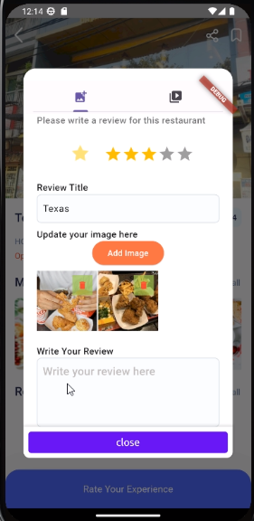

<!--Project logo and contributors-->
 

  
  
HCMUS

  
CS426 - Mobile Device Application Development

  

    Nguyen Dinh Tung
     
    Dang Trung Nghia
     
    Bui Nguyen Hoang
     
    Hoang Nghia Viet
     
    Tran Tuan Viet
     
  

<!--Table of contents-->

## About the project
AnTap is a food review application. The main purpose of the application is to help people easily access and search for restaurants nationwide. Users can easily view reviews about restaurants in both video and text formats, thereby facilitating their own experiences. A restaurant can be created new at the user's current location. Users can also interact with each other and create restaurant review posts in both text and video formats.

## Screens
### Login and Signup

    
    
    

- Users need to sign up and then login (if have not created an account yet), or just login (if they had an account) to turn to main screen.

### View image posts

    

- Users can see image reviews and text reviews of all restaurants posted by other reviewers.
- For each post, users can see the number of favourite customers, all comments posted before.
- Users can also comment on each post.

### View video posts

    

- This screen acts similarly to Tiktok, users can slide up/down to view all video posts.
- For each post, users can see the number of favourite customers (the number of hearts) and all comments posted before.
- Users can also comment on each post.

### Map

    

- Users can view all restaurants's location together with the current location of them.
- Users can zoom in/out, slide up/down/left/right to see all markers of restaurants.
- When clicking on each marker, turn to the screen of this restaurant's information.

### Check-in

    

- Users can create a new restaurant at current position by providing image and name of this restaurant.

### Create post

    
    
    

- Users can see all information about the particular restaurant.
- After that, they can share their evaluation for the restaurant by posting video or image reviews.

## Technologies used
- We build this application by Flutter framework (an open source Framework by Google) with Dart programming language.
- Use Firebase Authentication to manage some features: login, sign up and forget password.
- Use Cloud Firestore (a NoSQL cloud database) to store different types of data: restaurant information, user profile, image posts and video posts (through Firebase Storage).
- Integrate GoogleMap API for displaying map (view current position and all existing restaurants).
